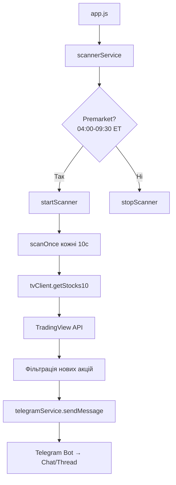

# 📈 Stocks10 Premarket Watcher

Автоматичний сканер акцій США з моніторингом премаркету та сповіщеннями в Telegram.

## 🎯 Що робить цей проект?

Проект сканує акції на американських біржах (NASDAQ, NYSE, AMEX) під час **премаркету** (04:00–09:30 за часом Нью-Йорку) та шукає акції з:

- **Зростанням 10%+** на премаркеті
- **Float ≤ 15M** (невеликий free float)
- **Обсягом премаркету > 50,000** акцій
- **Ціною ≥ $0.80**

При знаходженні нових акцій, система надсилає сповіщення в Telegram з інформацією про акцію.

## 🏗️ Архітектура проекту

```
tvstocks/
├── app.js                 # Головна точка входу
├── config.js              # Конфігурація з .env
├── scannerService.js      # Сервіс сканування (gatekeeper)
├── stockService.js        # Обробка даних акцій
├── telegramService.js     # Telegram бот сповіщень
├── tvClient.js            # Клієнт TradingView Scanner API
├── screenshot-service.js  # Сервіс скріншотів графіків (Playwright)
├── logger.js              # Централізоване логування
├── errorHandler.js        # Обробка помилок
├── validation.js          # Валідація даних
├── utils.js               # Реекспорт утиліт
└── utils/
    ├── time.js            # Робота з часом (NY timezone)
    ├── format.js          # Форматування повідомлень
    ├── state.js           # State manager
    └── hof.js             # Higher-order functions (retry, logging)
```

## 🔄 Потік даних



## 📋 Модулі

### `app.js` — Точка входу
- Ініціалізує конфігурацію та сервіси
- Налаштовує graceful shutdown (SIGINT, SIGTERM)
- Обробляє глобальні помилки

### `scannerService.js` — Планувальник
- **Gatekeeper**: Перевіряє чи зараз премаркет (кожні 30 сек)
- Запускає/зупиняє сканер автоматично
- State management для відстеження побачених символів

### `stockService.js` — Обробка акцій
- Отримує дані з TradingView API
- Фільтрує: тільки нові + float ≤ 15M
- Надсилає сповіщення для кожної нової акції

### `tvClient.js` — TradingView API
- POST запит до `scanner.tradingview.com/america/scan`
- Browser-like headers для обходу блокування
- Автоматичні retry з exponential backoff
- Фільтри: common/preferred stocks, DR

### `telegramService.js` — Telegram
- Використовує бібліотеку `telegraf`
- Підтримка thread ID для топіків
- Fallback якщо thread_id не працює
- Retry logic для надійності

### `screenshot-service.js` — Скріншоти
- Playwright для headless браузера
- Робить скріншоти 4H та 1M графіків
- Склеює в одне зображення (sharp)
- Відправляє в Telegram

## ⚙️ Конфігурація

### Змінні середовища (.env)

```env
# Telegram Bot Configuration
BOT_TOKEN=your_telegram_bot_token
CHAT_ID=your_telegram_chat_id
THREAD_ID=your_telegram_thread_id_optional

# Trading Configuration
PREMARKET_THRESHOLD=10        # Мінімальний % зростання
SCAN_INTERVAL_MS=10000        # Інтервал сканування (мс)
SEND_ON_STARTUP=false         # Надсилати всі акції при старті
```

### Ключові параметри

| Параметр | Значення | Опис |
|----------|----------|------|
| `premarketHours.start` | `04:00` | Початок премаркету (ET) |
| `premarketHours.end` | `09:30` | Кінець премаркету (ET) |
| `premarketThreshold` | `10` | Мінімальний % зростання |
| `scanIntervalMs` | `10000` | Інтервал сканування (10 сек) |
| `gatekeeperIntervalMs` | `30000` | Перевірка часу (30 сек) |

## 📦 Залежності

```json
{
  "telegraf": "^4.16.3",     // Telegram Bot API
  "dotenv": "^16.4.5",       // Змінні середовища
  "playwright": "^1.55.0",   // Скріншоти браузера
  "sharp": "^0.34.3"         // Обробка зображень
}
```

## 🚀 Запуск

### Локально

```bash
# Встановити залежності
npm install

# Запустити
npm start

# Або в dev режимі (з debug)
npm run dev
```

### Docker

```bash
# Зібрати образ
docker build -t stocks10-watcher .

# Запустити
docker run -d --env-file .env stocks10-watcher
```

### Fly.io

Проект готовий до деплою на Fly.io (див. `fly.toml`).

## 📝 Формат сповіщень

```
📈 NASDAQ:STEC
• Price: $2.45
• Change: +45.67%
• Float: 5.2M
• Vol: 1.2M
• $Dol-Vol$: $2.9M
```

## 🔍 Критерії фільтрації

TradingView Scanner API фільтри:

```javascript
{
  filter: [
    { left: "premarket_volume", operation: "greater", right: 50000 },
    { left: "premarket_change", operation: "greater", right: 10 },
    { left: "premarket_close", operation: "egreater", right: 0.8 }
  ],
  filter2: {
    // Тільки common stocks, preferred stocks, DR
    // Виключає ETF, фонди, тощо
  }
}
```

Додатковий фільтр у коді:
- `float_shares_outstanding ≤ 15,000,000` (або null)

## 🛡️ Обробка помилок

- **TradingViewError**: Помилки API (429 rate limit, 403 forbidden)
- **TelegramError**: Помилки надсилання повідомлень
- **ConfigurationError**: Невалідна конфігурація
- **ValidationError**: Невалідні дані

Глобальні помилки логуються та надсилаються в Telegram.

## 📊 Логування

Структуроване логування з рівнями:
- `DEBUG` — детальна інформація
- `INFO` — звичайні операції
- `WARN` — попередження
- `ERROR` — помилки

Приклад:
```
[12:34:56] [INFO] [SCANNER] 🔔 новий: NASDAQ:STEC, change=45.67%
[12:34:56] [INFO] [TG] sent ✔ id=123456 chat=-100xxx thread=789
```

## 📅 Розклад роботи

- **Пн-Пт**: 04:00–09:30 ET (премаркет)
- **Сб-Нд**: Не працює (вихідні)
- **Поза премаркетом**: Сканер автоматично зупиняється

## 🔧 Технічні деталі

### TradingView API

Проект використовує недокументований TradingView Scanner API:
- URL: `https://scanner.tradingview.com/america/scan`
- Метод: POST
- Headers: Browser-like для обходу блокування
- Timeout: 12 секунд
- Retries: 2 спроби з exponential backoff

### State Management

```javascript
{
  isRunning: false,        // Чи працює сканер
  isFirstScan: true,       // Перший скан (suppress notifications)
  seenSymbols: new Set(),  // Вже побачені символи
  scanTimer: null,         // Таймер сканування
  gateTimer: null          // Таймер gatekeeper
}
```

## ⚠️ Важливо

> ⚠️ **НЕ ЧІПАТИ `tvClient.js` без крайньої потреби!**
> TradingView може заблокувати при зміні headers або структури запиту.

## 📄 Ліцензія

MIT
