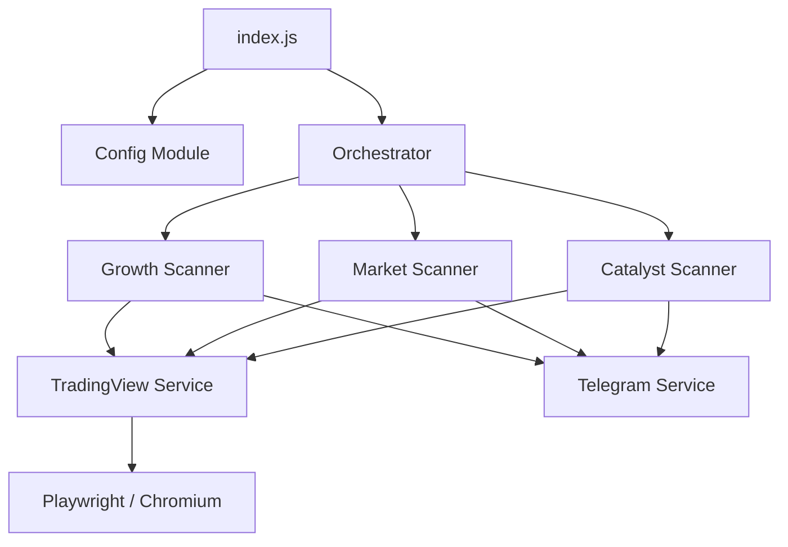

# Архітектура проекту 🏗️

Додаток побудований на базі модульної архітектури з використанням Node.js (ES Modules). Основний акцент зроблено на стабільності, керованості станом та чіткому розділенні обов'язків.

## Огляд системи

## Основні шари

### 1. Точка входу (`src/index.js`)
Відповідає за ініціалізацію всіх сервісів, реєстрацію обробників команд Telegram та налаштування граціозного завершення роботи (graceful shutdown).

### 2. Оркестратор (`src/core/orchestrator.js`)
"Мозок" системи. Він працює як диспетчер, який вмикає та вимикає різні сканери залежно від поточного часу (за часовим поясом Нью-Йорка).

- **Premarket**: 04:00 - 09:30 ET
- **Catalyst Setup**: 08:00 - 09:30 ET
- **Market Active**: 09:30 - 16:00 ET (або за налаштуваннями)

### 3. Сервіси та Сканери (`src/services/`)
- **Scanner (Growth)**: Найпростіший сканер для виявлення топ-гейнерів.
- **MarketService**: Складний аналіз ринкової активності.
- **CatalystService**: Снайперська стратегія для відстеження конкретних патернів.
- **TradingView**: Шар для взаємодії з API та веб-інтерфейсом TradingView через Playwright.

### 4. Ядро та Утиліти (`src/core/`)
Містить логування, глобальну обробку помилок (`errorHandler.js`) та допоміжні функції для роботи з часом, форматуванням та станом.

## Принципи проектування
- **State Management**: Використання `createStateManager` для ізоляції та контролю стану всередині кожного компонента.
- **Error Handling**: Глобальний обробник помилок, що сповіщає в Telegram про критичні збої.
- **Resilience**: Система автоматично намагається відновитися після помилок мережі або тайм-аутів API.
